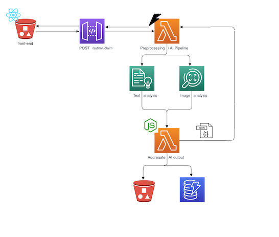

# AWS App Deployment Guide

A comprehensive step-by-step guide to deploy a full-stack claim processing application to AWS using AWS CDK. This application demonstrates integration with AWS Purpose-built AI Services (Comprehend and Rekognition) and serverless architecture patterns.

## Overview

This guide walks you through building and deploying a complete serverless application that:

- **Processes insurance claims** with text descriptions and accident photos
- **Analyzes text** using Amazon Comprehend (sentiment, entities, key phrases, language detection)
- **Analyzes images** using Amazon Rekognition (labels, text detection)
- **Stores data** in S3 (images) and DynamoDB (metadata)
- **Serves a React frontend** via S3 static website hosting
- **Exposes APIs** via API Gateway HTTP API

## Architecture

**Architecture Overview:**
- **Frontend (S3)**: React + TypeScript + Tailwind CSS application
- **API Gateway**: HTTP API endpoint (`/process-claim`)
- **Preprocessing Lambda**: Python/FastAPI function that calls Comprehend and Rekognition
- **Aggregate Lambda**: Node.js/TypeScript function that stores data in S3 and DynamoDB
- **S3 Bucket**: Stores uploaded claim images
- **DynamoDB Table**: Stores claim metadata and AI analysis results

## Step-by-Step Guides

Follow these guides in order:

1. **[1_SCAFFOLD_FRONTEND.md](local/1_SCAFFOLD_FRONTEND.md)** - Set up React application with TypeScript, Tailwind CSS, and form validation
2. **[2_BUILD_FRONTEND_UI.md](local/2_BUILD_FRONTEND_UI.md)** - Build the claim submission form UI with drag-and-drop file upload
3. **[3_BUILD_PREPROCESSING_LAMBDA.md](local/3_BUILD_PREPROCESSING_LAMBDA.md)** - Create the Preprocessing Lambda function with Comprehend and Rekognition integration
4. **[4_UPDATE_FRONTEND.md](local/4_UPDATE_FRONTEND.md)** - Connect the frontend to the Preprocessing Lambda backend
5. **[5_BUILD_AGGREGATE_LAMBDA.md](local/5_BUILD_AGGREGATE_LAMBDA.md)** - Create the Aggregate Lambda function for S3 and DynamoDB storage
6. **[6_SETUP_CDK.md](cdk/6_SETUP_CDK.md)** - Set up AWS CDK project and Lambda bundling helpers
7. **[7_BUILD_CDK_STACK.md](cdk/7_BUILD_CDK_STACK.md)** - Define the CDK stack with all AWS resources
8. **[8_DEPLOY_CDK.md](cdk/8_DEPLOY_CDK.md)** - Deploy the application to AWS and test

## Prerequisites

Before starting, ensure you have:

- **Node.js 20.x or higher** - For frontend and Aggregate Lambda
- **Python 3.12 or higher** - For Preprocessing Lambda and CDK
- **npm or yarn** - Package manager
- **AWS CLI** - Configured with credentials
- **AWS Account** - With permissions for:
  - Lambda
  - API Gateway
  - S3
  - DynamoDB
  - Comprehend
  - Rekognition
  - IAM
  - CloudWatch
- **Docker** - Required for Lambda bundling with CDK (Lambda runs on Linux, so Docker provides the Linux build environment needed for native dependencies)

## Tech Stack

### Frontend
- **React 19** - UI framework
- **TypeScript** - Type safety
- **Tailwind CSS** - Styling
- **Vite** - Build tool
- **React Hook Form + Zod** - Form validation

### Backend
- **FastAPI** (Python) - Preprocessing Lambda API
- **Express** (Node.js/TypeScript) - Aggregate Lambda API
- **boto3** (Python) - AWS SDK
- **@aws-sdk/client-s3** (Node.js) - S3 operations
- **@aws-sdk/client-dynamodb** (Node.js) - DynamoDB operations

### Infrastructure
- **AWS CDK (Python)** - Infrastructure as Code
- **API Gateway HTTP API** - API endpoint
- **Lambda** - Serverless compute
- **S3** - Static website hosting and image storage
- **DynamoDB** - Metadata storage

## AWS Services Used

1. **Amazon Comprehend** - Text analysis (sentiment, entities, key phrases, language detection)
2. **Amazon Rekognition** - Image analysis (labels, text detection)
3. **AWS Lambda** - Serverless compute for processing
4. **API Gateway** - HTTP API endpoint
5. **Amazon S3** - Frontend hosting and image storage
6. **Amazon DynamoDB** - Claim metadata storage
7. **AWS CDK** - Infrastructure deployment

## What You'll Build

By the end of these guides, you'll have:

✅ A React frontend deployed to S3  
✅ Two Lambda functions (Preprocessing and Aggregate)  
✅ API Gateway HTTP API  
✅ S3 bucket for image storage  
✅ DynamoDB table for metadata  
✅ Complete CI/CD-ready infrastructure  
✅ Full integration with AWS AI services  

## Estimated Time

- **Local Development Setup**: 2-3 hours
- **CDK Setup and Deployment**: 1-2 hours
- **Total**: 3-5 hours

## Cost Estimate

For light testing and development:
- **Lambda**: ~$0.20 per million requests
- **DynamoDB**: ~$1.25 per million requests
- **S3**: ~$0.023 per GB storage + $0.005 per 1,000 requests
- **API Gateway**: ~$1.00 per million requests

**Total for light usage: < $1-2 per month**

## Getting Started

Begin with [1_SCAFFOLD_FRONTEND.md](local/1_SCAFFOLD_FRONTEND.md) to set up the frontend application.

## Notes

- All guides are designed to be followed sequentially
- Code examples are complete and tested
- Local development is supported before deployment
- The CDK stack can be destroyed with `cdk destroy` to clean up resources
