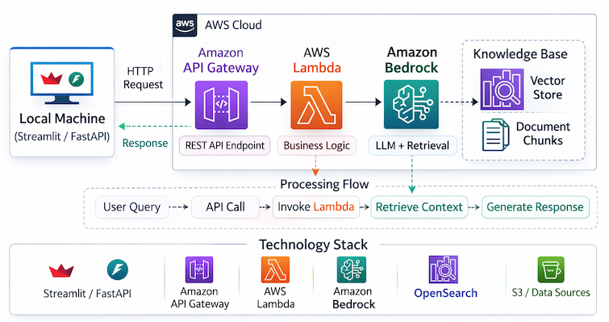

# AI Agent Insure — Knowledge Assistant

A full-stack local demo that queries an Amazon Bedrock RAG Knowledge Base.

<div align="center">
  
</div>

---

## Prerequisites

This app requires the AWS infrastructure from [`4_Bedrock_RAG_KB`](../4_Bedrock_RAG_KB/) to be deployed and running:

- S3 bucket with markdown documents in `assets/`
- Bedrock Knowledge Base with OpenSearch Serverless vector store
- RAG Lambda (`lambda.py`) connected to the Knowledge Base
- API Gateway REST API with a `POST /<resource>` route proxying the Lambda

Bedrock model access must be enabled in your AWS account for:
- Amazon Titan Text Embeddings V2 (embedding model)
- Anthropic Claude 3.5 Sonnet (inference model)

---

## Project Structure

```
5_Bedrock_RAG_KB_App_Integration/
├── backend/
│   ├── api.py               # FastAPI app — proxies queries to API Gateway
│   ├── requirements.txt
│   └── .env.example
└── frontend/
    ├── app.py               # Streamlit UI
    ├── requirements.txt
    └── .env.example
```

---

## Backend Setup

**1. Navigate to the backend folder**

```bash
cd backend
```

**2. Create a virtual environment and install dependencies**

```bash
uv venv --python 3.12
source .venv/bin/activate
uv pip install -r requirements.txt
```

**3. Configure environment**

```bash
cp .env.example .env
```

Edit `.env` with your API Gateway invoke URL:

```
API_URL=https://<api-id>.execute-api.<region>.amazonaws.com/<stage>/<resource>
```

**4. Run**

```bash
uvicorn api:app --reload
```

Runs at `http://localhost:8000`. Swagger UI available at `http://localhost:8000/docs`.

---

## Frontend Setup

**1. Navigate to the frontend folder**

```bash
cd frontend
```

**2. Create a virtual environment and install dependencies**

```bash
uv venv --python 3.12
source .venv/bin/activate
uv pip install -r requirements.txt
```

**3. Configure environment**

```bash
cp .env.example .env
```

The default `.env` points to the local backend — no changes needed unless running the backend on a different port:

```
FASTAPI_URL=http://localhost:8000
```

**4. Run**

```bash
streamlit run app.py
```

Opens in your browser at `http://localhost:8501`.

---

## Usage

1. Start the backend first, then the frontend (in separate terminals).
2. Type a question about AI Agent Insure products or coverage.
3. Click **Ask**.
4. The generated answer and cited source documents are displayed.

---

## Response Fields

| Field | Description |
|---|---|
| `generated_response` | Claude's synthesized answer from the knowledge base |
| `s3_locations` | S3 URIs of the source documents cited in the answer |
| `query` | The original question (echoed back) |
