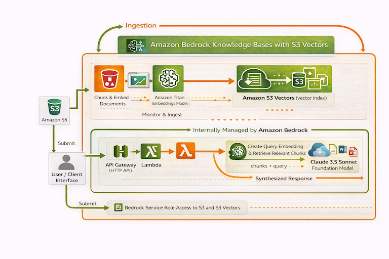

# AI Agent Insure — RAG Knowledge Assistant (S3 Vectors)

A full-stack Retrieval-Augmented Generation (RAG) application demonstrating Amazon Bedrock Knowledge Bases backed by **S3 Vectors** — AWS's cost-effective alternative to OpenSearch Serverless.

---

## Why S3 Vectors?

| | OpenSearch Serverless | S3 Vectors |
|---|---|---|
| Minimum cost | ~$700 / month | ~$0.00 at demo scale |
| Setup complexity | High (collection, index, AOSS policies) | Low (bucket + index) |
| Bedrock KB support | Yes (original) | Yes (2025) |
| Best for | Production at scale | Low-traffic apps, Demos, Learning |

This module is the S3 Vectors equivalent of modules `4_Bedrock_RAG_KB` + `5_Bedrock_RAG_KB_App_Integration`, combined into one project. See **[Comparison of modules 4, 5, and 6](./Comparison_Modules_4_5_6.md)** for a side-by-side breakdown.

---

## Architecture

<div align="center">
  
</div>

```
React UI (S3 static website)
    │
    │  HTTPS POST /chat
    ▼
API Gateway (HTTP API)
    │
    │  Lambda proxy integration (payload v2)
    ▼
Lambda (lambda/lambda.py)
    │
    │  retrieve_and_generate
    ▼
Bedrock Knowledge Base
    ├── Foundation Model (Claude 3 Haiku) — generates the answer
    └── S3 Vectors (vector index) — stores embeddings
            └── S3 (docs bucket) — stores source documents
                 └── 4_Bedrock_RAG_KB/assets/ (shared KB corpus)
```

---

## Project Structure

```
6_Bedrock_RAG_KB_S3_Vectors/
├── cdk/                               # CDK (TypeScript) — automated deployment
│   ├── src/
│   │   ├── app.ts                     # CDK app entry point
│   │   ├── rag-stack.ts               # Single stack — wires constructs, outputs
│   │   └── constructs/
│   │       ├── knowledge-base.ts      # Docs bucket, S3 Vectors, KB role, Bedrock KB + data source
│   │       └── lambda-api.ts          # Lambda role, Lambda function, HTTP API + CORS
│   ├── package.json
│   ├── tsconfig.json
│   └── cdk.json
├── lambda/
│   └── lambda.py                      # Lambda handler — calls retrieve_and_generate
├── frontend/
│   ├── src/
│   │   ├── App.tsx                    # Main UI — query input, answer, sources
│   │   ├── main.tsx
│   │   ├── index.css                  # Tailwind + scrollbar styles
│   │   ├── types.ts
│   │   ├── vite-env.d.ts
│   │   ├── services/api.ts            # fetch wrapper for API Gateway
│   │   └── components/
│   │       ├── SourcePill.tsx         # Displays a cited source document
│   │       └── ExamplePrompts.tsx     # Clickable example questions
│   ├── index.html
│   ├── package.json
│   ├── vite.config.ts
│   ├── tailwind.config.js
│   ├── tsconfig.json
│   ├── tsconfig.node.json
│   ├── postcss.config.js
│   ├── .env.example
│   └── .gitignore
├── iam/                               # Reference JSON for the manual deployment path
│   ├── README.md
│   ├── lambda-trust-policy.json
│   ├── lambda-inline-policy.json
│   ├── kb-trust-policy.json
│   └── kb-inline-policy.json
├── MANUAL_DEPLOYMENT.md               # Console-based deployment walkthrough
├── env.example
└── README.md
```

> **KB documents** are not duplicated here — they live in [`4_Bedrock_RAG_KB/assets/`](../4_Bedrock_RAG_KB/assets/) and are shared across modules 4, 5, and 6.

---

## Prerequisites

- **AWS account** with Bedrock model access enabled for:
  - **Claude 3 Haiku** (`anthropic.claude-3-haiku-20240307-v1:0`) — on-demand, no inference profile
  - `amazon.titan-embed-text-v2:0`
- **AWS CLI** configured with credentials for us-east-1
- **AWS CDK v2 CLI** installed globally (TypeScript), for example: `npm install -g aws-cdk`
- **Node.js 18+** and **npm** (for the React frontend and CDK)


---

## Part 1 — Deploy the AWS Infrastructure

Choose **one** of the two options below.

### Option A — Manual (AWS Console)

Follow the step-by-step console walkthrough in **[MANUAL_DEPLOYMENT.md](./MANUAL_DEPLOYMENT.md)**.

### Option B — CDK (automated)

One command deploys everything: IAM roles, S3 docs bucket (with documents), S3 Vectors bucket + index, Bedrock Knowledge Base + data source, Lambda, and API Gateway.

**First-time only — bootstrap CDK in your account:**

```bash
npx cdk bootstrap aws://ACCOUNT_ID/us-east-1
```

**Deploy:**

```bash
cd cdk
npm ci
npx cdk deploy
```

CDK prints three stack outputs when it finishes:

| Output | What it is |
|--------|------------|
| `ApiUrl` | Full API endpoint (e.g. `https://xxxx.execute-api.us-east-1.amazonaws.com/chat`) — use as `VITE_API_URL` |
| `KnowledgeBaseId` | Bedrock Knowledge Base ID |
| `DocsBucketName` | S3 bucket containing the KB source documents |

**After the first deploy**, sync the data source so Bedrock ingests the documents:

1. Bedrock console → **Knowledge bases** → open the KB → **Data source** → **Sync**

> Subsequent deploys (`npx cdk deploy`) update only what changed — no manual sync needed unless the corpus documents change.

---

## Part 2 — Run the Frontend Locally

Use the existing frontend in `frontend/`, or follow **[frontend/GETTING_STARTED.md](./frontend/GETTING_STARTED.md)** to build the app from scratch (scaffold, paste code, same hands-on style as the IAM/Lambda setup).

```bash
cd frontend
cp .env.example .env
```

Edit `.env` with your API Gateway URL:

- **CDK users:** copy the `ApiUrl` stack output.
- **Manual users:** copy the Invoke URL from the API Gateway console and append `/chat`.

```
VITE_API_URL=https://your-api-id.execute-api.us-east-1.amazonaws.com/chat
```

> HTTP API URLs don't include the stage name in the path — it's `/chat` not `/prod/chat`.

Install and run:

```bash
npm install
npm run dev
```

Opens at `http://localhost:3000`.

---

## Part 3 — Deploy the Frontend to S3

```bash
cd frontend
npm run build
```

Upload the contents of `frontend/dist/` to your S3 static website bucket.

---

## What the App Does

Type any question about AI Agent Insure products. The app:

1. POSTs the question to API Gateway
2. Lambda calls `retrieve_and_generate` — Bedrock retrieves relevant chunks from the S3 Vectors index and generates a grounded answer using Claude
3. The answer and cited source documents are displayed in the UI

### Example questions

- "What products does AI Agent Insure offer?"
- "What does Agentic AI Liability Insurance cover?"
- "Does AI Agent Insure cover regulatory fines?"
- "What is the coverage limit for AI Infrastructure Operations Protection?"
- "How does the claims process work?"

---

## Cost (~48 hours)

| Service | Cost |
|---|---|
| S3 Vectors (storage + queries) | ~$0.01 |
| Bedrock inference (Claude 3 Haiku) | ~$0.05 |
| Lambda, API Gateway, S3 | ~$0.00 (free tier) |
| **Total** | **~$0.11** |

Compare to OpenSearch Serverless: **~$140** for the same 48 hours.

---

## Tear Down

### CDK

```bash
cd cdk
npx cdk destroy
```

CDK deletes all resources it created (IAM roles, buckets, KB, Lambda, API Gateway). The S3 docs bucket is configured with `autoDeleteObjects`, so it empties itself before deletion.

### Manual

See the **Manual Tear Down** section at the bottom of **[MANUAL_DEPLOYMENT.md](./MANUAL_DEPLOYMENT.md)**.
